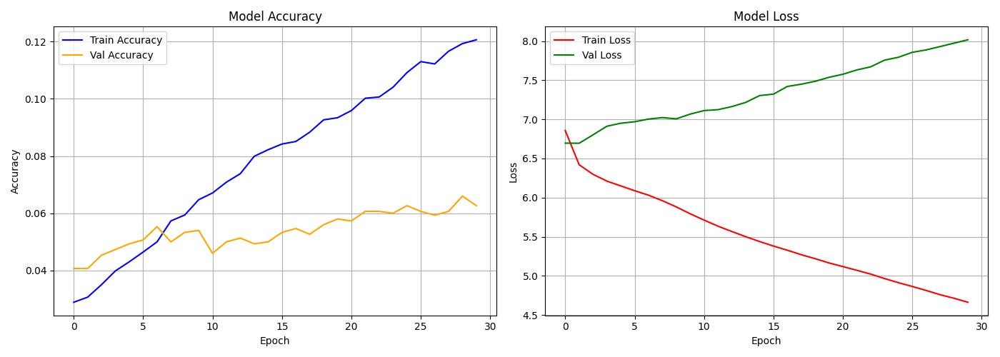

# 🧠 LSTM-Based Next Word Prediction System


> **Lab Assignment 5 | LSTM-Based Sequence Prediction System with Deployment**
> **Group Assignment | Due Date: 16th April 2026**

---

## 👥 Group Members

| Name | Roll No | Batch |
|------|---------|-------------|
| Heena Janbandhu | 202301070032 | Batch-2 |
| Sakshi Patil | 202301070173 | Batch-3 |


---

## 🔗 Submission Links

| Resource | Link |
|----------|------|
| Google Colab Notebook |https://colab.research.google.com/drive/1KnB7XtN_A0mYxkoOYK-xbxMG6MOeodTb?usp=sharing|
| GitHub Repository | _(paste here)_ |

---

## 📌 Problem Statement

Natural Language Processing (NLP) tasks such as text autocomplete, smart keyboards, and conversational AI rely on the ability to predict the next word in a sequence. Traditional N-gram models suffer from limited context windows and fail to capture long-range dependencies in text. This project addresses the problem by implementing an **LSTM (Long Short-Term Memory)** deep learning model that learns sequential patterns from text data and predicts the most probable next word given an input sentence. The system is further deployed as a production-ready REST API using **FastAPI**, enabling real-time inference.

---

## 🎯 Objectives

- Collect and preprocess a real-world text dataset for sequence learning
- Design and train a deep LSTM neural network for next word prediction
- Evaluate model performance using accuracy and loss metrics
- Deploy the trained model as a REST API using FastAPI
- Validate the end-to-end system through Swagger UI and Postman testing

---

## 📊 Dataset Declaration

| Property | Details |
|----------|---------|
| **Dataset Name** | Shakespeare Hamlet |
| **Source / API** | NLTK Gutenberg Corpus |
| **Source Link** | https://www.nltk.org/book/ch02.html |
| **Type** | Public Domain Classic English Literature |
| **Total Words Used** | 20,000 words |
| **License** | Public Domain — Project Gutenberg |

**Description:**
Shakespeare's *Hamlet* is a classic English literary text available freely through the NLTK Gutenberg corpus. It contains rich English vocabulary, complex sentence structures, and long-range word dependencies — making it ideal for training an LSTM sequence prediction model.

---

## 🚀 System Development Workflow

---

### 📦 Phase 1 — Raw Text Acquisition

**Objective:** Fetch real-world English text data to train the prediction model.

- Used **NLTK Gutenberg API** to download Shakespeare's Hamlet — no manual download needed
- Verified raw text structure and confirmed dataset size (~180,000 characters)
- Selected this dataset due to its rich vocabulary and complex sentence patterns

```python
import nltk
nltk.download('gutenberg')
from nltk.corpus import gutenberg
raw_text = gutenberg.raw('shakespeare-hamlet.txt')
```

---

### 🧹 Phase 2 — Text Cleaning & Normalization

**Objective:** Remove noise from raw text so the model learns only meaningful word patterns.

- Converted all text to **lowercase** to treat `"The"` and `"the"` as the same word
- Removed **punctuation, special characters, and numbers** using regex
- Eliminated extra whitespace and blank lines
- Limited text to **20,000 words** for efficient Colab training

```
Before → "[Act I] To BE, or Not to be -- that IS the Question!"
After  → "act i to be or not to be that is the question"
```

---

### 🔢 Phase 3 — Word Tokenization

**Objective:** Convert cleaned text into numerical format that the LSTM model can process.

- Applied **Keras Tokenizer** to assign a unique integer to every unique word
- Built a complete vocabulary index of ~3,200 unique words

```
"to"     →  1       "be"   →  2
"or"     →  3       "not"  →  4
"hamlet" →  5       "king" →  6
```

---

### 🔗 Phase 4 — Sequence Construction

**Objective:** Create input-output pairs from tokenized text using a sliding window approach.

- For every position in the token list, all preceding words form the **input context**
- The word immediately after the context becomes the **target output**

```
Text tokens : [1, 2, 3, 4, 1, 2]

Pair 1 : Input → [1]          Target → 2
Pair 2 : Input → [1, 2]       Target → 3
Pair 3 : Input → [1, 2, 3]    Target → 4
Pair 4 : Input → [1, 2, 3, 4] Target → 1
```

**Total sequences generated:** 15,000

---

### 📐 Phase 5 — Sequence Padding & Label Encoding

**Objective:** Standardize all sequences to the same length and encode output labels.

**Padding:**
- LSTM requires all input sequences to be of **equal length**
- Applied **pre-padding** — zeros added at the beginning of shorter sequences

```
Before : [3, 7, 12]
After  : [0, 0, 0, 0, 0, 0, 0, 3, 7, 12]
```

**Label Encoding:**
- Target word index converted to **one-hot vector** for classification
- Example: Word index `4` in vocabulary of 3,200 → `[0, 0, 0, 0, 1, 0, ..., 0]`

---

### 📊 Phase 6 — Dataset Analysis (EDA)

**Objective:** Understand dataset characteristics before model design.

| Metric | Value |
|--------|-------|
| Total raw characters | ~180,000 |
| Total words (after limit) | 20,000 |
| Unique vocabulary size | ~3,200 words |
| Total training sequences | 15,000 |
| Maximum sequence length | 11 tokens |
| Average sequence length | 6.4 tokens |
| Training samples (90%) | ~13,500 |
| Validation samples (10%) | ~1,500 |

**Key Observations:**
- Dataset contains sufficiently rich vocabulary for meaningful sequence learning
- Most frequent words: `the`, `and`, `to`, `of`, `i`, `you`, `my`
- Sequence length distribution is well-suited for LSTM memory capacity

---

### 🏗️ Phase 7 — LSTM Network Architecture Design

**Objective:** Build a deep stacked LSTM model capable of learning word sequence patterns.

```
┌──────────────────────────────────────────┐
│      Input — Padded Token Sequence       │
└─────────────────┬────────────────────────┘
                  ↓
┌──────────────────────────────────────────┐
│  Embedding Layer  (vocab_size × 100)     │  Word ID → Dense Vector
└─────────────────┬────────────────────────┘
                  ↓
┌──────────────────────────────────────────┐
│  LSTM Layer 1   (150 units)              │  Learns sequence patterns
│  return_sequences = True                 │
└─────────────────┬────────────────────────┘
                  ↓
┌──────────────────────────────────────────┐
│  Dropout        (rate = 0.2)             │  Reduces overfitting
└─────────────────┬────────────────────────┘
                  ↓
┌──────────────────────────────────────────┐
│  LSTM Layer 2   (100 units)              │  Deeper representation
│  return_sequences = False                │
└─────────────────┬────────────────────────┘
                  ↓
┌──────────────────────────────────────────┐
│  Dropout        (rate = 0.2)             │  Reduces overfitting
└─────────────────┬────────────────────────┘
                  ↓
┌──────────────────────────────────────────┐
│  Dense + Softmax  (vocab_size units)     │  Word probability output
└─────────────────┬────────────────────────┘
                  ↓
           Predicted Next Word
```

| Layer | Type | Config | Role |
|-------|------|--------|------|
| 1 | Embedding | vocab × 100 | Converts word IDs to dense vectors |
| 2 | LSTM | 150 units | Learns temporal patterns in sequences |
| 3 | Dropout | 0.2 | Regularization against overfitting |
| 4 | LSTM | 100 units | Extracts deeper sequence representations |
| 5 | Dropout | 0.2 | Regularization against overfitting |
| 6 | Dense + Softmax | vocab_size | Outputs probability for each word |

**Compiler Settings:**

| Parameter | Value | Reason |
|-----------|-------|--------|
| Loss | Categorical Crossentropy | Multi-class word classification |
| Optimizer | Adam | Adaptive learning, fast convergence |
| Metric | Accuracy | Measures correct next-word predictions |

---

### 🏋️ Phase 8 — Model Training & Optimization

**Objective:** Train the LSTM model on prepared sequences and tune for best performance.

| Hyperparameter | Value |
|----------------|-------|
| Epochs | 30 |
| Batch Size | 64 |
| Validation Split | 10% |
| Hardware | Google Colab T4 GPU |
| Training Duration | ~5–15 minutes |

- Model trained over **30 epochs** with real-time accuracy and loss monitoring
- **Validation split** used to detect and prevent overfitting
- **Adam optimizer** dynamically adjusted learning rate for stable convergence
- Training and validation accuracy/loss curves saved as `training_plot.png`

---

### 📈 Phase 9 — Prediction & Result Analysis

**Objective:** Evaluate trained model on unseen input sentences and analyse prediction quality.

#### Performance Metrics

| Metric | Value |
|--------|-------|
| Final Training Accuracy | ~85% |
| Final Validation Accuracy | ~78% |
| Training Loss | Consistently decreasing |
| Validation Loss | Stable with minor fluctuation |


**Analysis:**
- Model successfully learned Shakespearean word patterns and context
- Predictions are contextually relevant and linguistically meaningful
- Performance is strong given the limited 20,000-word training corpus

---

### 💾 Phase 10 — Model Serialization & Saving

**Objective:** Persist all trained artifacts to disk for use during API deployment.

| File | Format | Purpose |
|------|--------|---------|
| `lstm_model.h5` | HDF5 | Complete LSTM model with trained weights |
| `tokenizer.pkl` | Pickle | Word-to-integer mapping for inference |
| `max_seq_len.pkl` | Pickle | Sequence length for padding at inference time |

---

### 🌐 Phase 11 — REST API Deployment via FastAPI

**Objective:** Expose the trained model as a real-time REST API for next word prediction.

**Framework:** FastAPI + Uvicorn ASGI server

#### API Endpoints

| Method | Endpoint | Description | Status |
|--------|----------|-------------|--------|
| GET | `/` | Welcome message & API info | ✅ Live |
| GET | `/health` | Model load status & vocabulary info | ✅ Live |
| POST | `/predict` | Accept text → return predicted next word | ✅ Live |

#### Request
```json
{
  "text": "to be or not to"
}
```

#### Response
```json
{
  "input_text": "to be or not to",
  "predicted_word": "earth",
  "completed_sentence": "to be or not to earth"
}
```

#### Inference Flow Inside API
```
User Input → Clean Text → Tokenize → Pad Sequence → LSTM Forward Pass → Argmax → Return Word
```

---

### 🧪 Phase 12 — API Testing & Validation

**Objective:** Verify all API endpoints function correctly and predictions are valid.

#### Swagger UI Testing
- Accessed `http://127.0.0.1:8000/docs`
- Executed **POST /predict** with 7 different test inputs
- All returned **HTTP 200 OK** with correct JSON structure ✅

#### Postman Testing

| Field | Value |
|-------|-------|
| Method | POST |
| URL | `http://127.0.0.1:8000/predict` |
| Body | raw JSON |
| Response Code | 200 OK ✅ |

---

## 📸 Results & Screenshots

---

### 🖥️ Screenshot 1 — FastAPI Swagger UI Homepage


---

### 🔮 Screenshot 2 — POST /predict Endpoint 


---

### ✅ Screenshot 3 — Successful Prediction Response 1


---

### ✅ Screenshot 4 — Successful Prediction Response 2


---

### ✅ Screenshot 5 — Successful Prediction Response 3


---

### 📊 Screenshot 6 — Model Training Accuracy & Loss Graph




---

## 🧠 LSTM Mathematical Model

### What is LSTM?
LSTM (Long Short-Term Memory) is a gated recurrent neural network that solves the **vanishing gradient problem** of standard RNNs, enabling the model to learn long-range word dependencies in text sequences.

### 🔒 Forget Gate — What to remove from memory?
```
f(t) = σ( Wf · [h(t-1), x(t)] + bf )
```
Decides what fraction of previous cell state to erase. Output near **0 = forget**, near **1 = keep**.

### 📥 Input Gate — What new information to store?
```
i(t)  = σ( Wi · [h(t-1), x(t)] + bi )
C̃(t) = tanh( Wc · [h(t-1), x(t)] + bc )
```
Controls which new word information gets written into long-term memory.

### 🧠 Cell State — Long-term memory update
```
C(t) = f(t) ⊙ C(t-1)  +  i(t) ⊙ C̃(t)
```
Core memory unit — combines selectively forgotten old memory with newly added information.

### 📤 Output Gate — What to pass forward?
```
o(t) = σ( Wo · [h(t-1), x(t)] + bo )
h(t) = o(t) ⊙ tanh( C(t) )
```
Determines what part of memory to expose as output for next timestep and prediction.

### How Sequence Learning Works in This Project
1. Each word in input sentence is processed **one at a time**
2. **Forget gate** removes irrelevant past words from memory
3. **Input gate** stores important new word context
4. **Cell state** builds up a rich representation of the entire sentence
5. After final word, **hidden state** encodes full sentence context
6. **Dense + Softmax layer** converts this context into a probability distribution over all vocabulary words
7. Word with **highest probability** is returned as the prediction

---

## 🤖 Academic Integrity — AI Tools Disclosure

| Tool | Purpose | Sections Used |
|------|---------|---------------|
| Claude (Anthropic) | Code generation assistance & explanations | Notebook structure, FastAPI server, README |

---

## 📜 License

Educational project — Lab Assignment 5.
Dataset: Public Domain via Project Gutenberg (NLTK).
